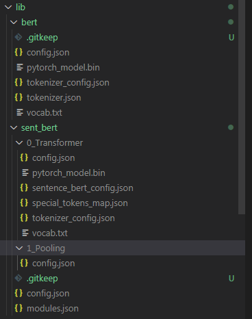

# API Miner

API-Miner recommends semantically similar API Specification snippets to promote discoverability and consistency in designing OpenAPI Specification (OAS).
- More specifically, given an endpoint spec (i.e. snippet of the OpenAPI specification that contains an endpoint/ path of interest) as the user query, API-Miner will retrieve the most relevant and high quality endpoint specs from your database


## Maintenance Level
This repository is maintained to fix bugs and ensure the stability of the existing codebase. However, please note that the team does not plan to introduce new features or enhancements in the future.

## Quick Setup
### 1) Clone API-Miner into your local system

```bash
git clone <link>
```

### 2) Load your dataset
- Download OpenAPI specifications from your local repo or a public github repository (eg.. https://github.com/APIs-guru/openapi-directory)
- Transfer the folders containing OpenAPI specifications (in JSON or YAML) into api-Miner/data/raw

### 3) Set up your environment
- pip install all dependencies
```bash
pip install -r requirements.txt
```

- Follow the instructions on (http://www.nltk.org/data.html) to download the nltk_data folder inside your environment. We need this to load WordNet library
```bash
api-Miner$ python
>> import nltk
>> nltk.download()
```

- Follow the instructions on (https://github.com/google-research/bert#pre-trained-models) to download BERT-base uncased model. Transfer the model files to api-Miner/lib/bert/
- Follow the instructions on (https://github.com/UKPLab/sentence-transformers) to download sentence bert model (MiniLM-L6-H384-uncased). Transfer the model files to api-Miner/lib/sent_bert
-  After transfering the files, you should see the following files in the lib folder:



## Boot up demo
### 1. demo.py
- To boot up a command line version of the demo, run:
```bash
api-Miner$ python demo.py
```
- After dataset, database and demo model is set up, the commandline should output the following message:
```bash
Interactive API Miner Demo
```
Run endpoint_demo()
- to generate a random endpoint name from the database, and see what endpoints get retrieved as relevant

Run endpoint_modified_spec_demo(modify_type='early_draft')
- to modify a random endpoint spec from the database to mimic an early draft, and see what endpoints get retrieved as relevant

Run endpoint_modified_spec_demo(modify_type='masked')
- to modify a random endpoint spec from the database by removing sections and masking tokens, and see what endpoints get retrieved as relevant

Run endpoint_modified_spec_demo(modify_type='mangled')
- to modify a random endpoint spec from the database by removing sections and mangling tokens (i.e. replacing with synonymns or mispelled counterparts) , and see what endpoints get retrieved as relevant

### 2. app.py 
- To boot up the UI visualization app version of the demo, run:
```bash
api-Miner$ python app.py
```
- This will launch an app on your local server
- You can either use the randomly modified endpoint spec as the query, or write your own query, to see what API-Miner will retrieve as relevant endpoints


NOTE: Both demo.py and app.py will trigger dataset, database and demo model set up. The set up will only run the first time and may take several hours to complete. You should only run 1 of either demo.py or app.py at a time during initialization to avoid collision errors. 
- dataset set up: going through OpenAPI specifications in api-Miner/data/raw and saving specifications that are valid (i.e. one of the supported versions, and formed correctly)
- database set up: going through valid OpenAPI specifications,  extracting key components (i.e. tree path tokens, natural language texts) from each unique endpoint, and saving them into the database (api-Miner/data/processed/database/data.db) 
- demo model set up: fits an API-Miner model based on the configurations outlined in api-Miner/experiments/demo_configs.py

### 3) Changing configurations for demo model
- To explore different configurations of API-Miner for your demo, feel free to edit api-Miner/experiments/demo_configs.py
- The default configuration of API-Miner is set to the following:

```bash
DEMO_CONFIG = {
    TREE_CONFIG:tfidf, 
    TEXT_CONFIG:tfidf, 
    FUZZY_CONFIG:fuzzy_true, 
    BERT_CONFIG:none_val,  
    PPMI_CONFIG:avg_emb,  
    KEYWORD_EMB_CONFIG:none_val, 
    EMB_CONCAT_CONFIG:none_val, 
    LAPLACE_K:none_val, 
    ALPHA:0.1, 
    KEEP_TOP_K:none_val, 
    TREE_WEIGHT: 0.3, 
    TEXT_WEIGHT: 0.3, 
    FUZZY_WEIGHT: 0.3, 
    QUALITY_WEIGHT: 0.1
}
```

- You can edit the configurations to change which sources of similarity to account for, featurization methods, etc. 
- Once you edit api-Miner/experiments/demo_configs.py, you can re-run demo.py or app.py to play around with this new model configuration. The program will detect a change in the configuration and re-fit the demo model. 
- Below we outline some definitions and config options for your reference. 

#### Definitions:
- TREE_CONFIG: featurization method for tree path tokens
- TEXT_CONFIG: featurization method for natural language text tokens
- BERT_CONFIG: type of pre-trained model to generate BERT embeddings of text tokens (eg. Bert or Sentence-Bert)
- PPMI_CONFIG: scaling scheme applied upon converting PPMI token embeddings to sentence embeddings per endpoint
- KEYWORD_EMB_CONFIG: pre-processing applied to keyword embeddings of text tokens prior to combining with BERT embeddings
- EMB_CONCAT_CONFIG: pre-processing applied to keyword and bert embeddings prior to combining together to generate enriched embeddings of text tokens
- LAPLACE_K: K value added to the co-occurrence matrix prior to generating PPMI embeddings (for laplace smooothing)
- ALPHA: Weighting PPMI matrix to give rare context words sightly higher probability  
- KEEP_TOP_K: keep top k of the co-occurrence matrix prior to generating PPMI embeddings (for dimensionality reduction)
- FUZZY_CONFIG: flag to determine whether or not to use fuzzy matching of endpoint names when computing similarity
- TREE_WEIGHT: weighs similarity scores obtained from tree path token features
- TEXT_WEIGHT: weighs similarity scores obtained from natural language text token features
- FUZZY_WEIGHT: weighs similarity scores obtained from fuzzy matching of endpoint names
- QUALITY_WEIGHT: weighs quality score obtained from validating specifications in database (NOTE: should not be too high to retrieve relevant / similar endpoints)
- tfidf: featurization using TF-IDF (term frequency–inverse document frequency)
- ppmi: featurization using PPMI (positive pointwise mutual information)
- bert: featurization using BERT (Bidirectional Encoder Representations from Transformers)
- bert_original: featurization using original BERT obtained from (https://huggingface.co/transformers/model_doc/bert.html)
- bert_sent: featurization using Sentence-BERT obtained from (https://www.sbert.net/)
- tfidf_bert: featurization obtained from combining TFIDF embeddings of keyword tokens and BERT embeddings of the entire text
- ppmi_bert: featurization obtained from combining PPMI embeddings of keyword tokens and BERT embeddings of the entire text
- avg_emb: compute PPMI embeddings of the entire text by finding the average of its token embeddings obtained from the PPMI matrix
- t_svd: Truncated SVD applied to the keyword embeddings prior to combining with BERT embeddings
- cca: Canonical Correlation Analysis applied to both keyword and bert embeddings to transform them into the same space prior to combining them together
- concat: combine keyword embeddings and BERT embeddings without transforming them 
- none_val: used to deactivate a certain configuration

#### Options for featurization:
- TREE_CONFIG: [tfidf, ppmi] OR [none_val] (deactivated)
- TEXT_CONFIG: [tfidf, ppmi, bert, tfidf_bert, ppmi_bert] OR [none_val] (deactivated)
- BERT_CONFIG: [bert_original, bert_sent] IF TEXT_CONFIG is one of = [bert, tfidf_bert, ppmi_bert], ELSE [none_val]
- PPMI_CONFIG: [avg_emb] IF TREE_CONFIG = [ppmi] and/or TEXT_CONFIG is one of = [ppmi, ppmi_bert], ELSE [none_val]
- KEYWORD_EMB_CONFIG: [t_svd] IF TEXT_CONFIG is one of = [tfidf_bert, ppmi_bert], ELSE [none_val]
- EMB_CONCAT_CONFIG: [cca, concat] IF TEXT_CONFIG is one of = [tfidf_bert, ppmi_bert], ELSE [none_val]
- LAPLACE_K: int value OR [none_val] (deactivated)
- ALPHA: float value
- KEEP_TOP_K: int value OR [none_val] (deactivated)

#### Options for computing similarity scoring:
- FUZZY_CONFIG: [fuzzy_true] OR [none_val] (deactivated)
- TREE_WEIGHT: float value
- TEXT_WEIGHT: float value
- FUZZY_WEIGHT: float value
- QUALITY_WEIGHT: float value

NOTE: sum(TREE_WEIGHT, TEXT_WEIGHT, FUZZY_WEIGHT, QUALITY_WEIGHT) MUST equal 1


## Using individual components from API-Miner

Alternatively, you can make use of the individual components of API-Miner.

- First, install api-Miner as a package using the following commands:
```bash
pip install api-Miner
```

i) To parse OpenAPI specifications (version 2.0) to extract key features such as tree path tokens, natural language texts and keyword text embeddings, you can make use of the Parser as follows:

```bash
from api_miner.data_processing.parser import APIParserSwagger

spec = { ... } #  insert OpenAPI specification in JSON format
parser = APIParserSwagger()
endpoint_objects = parser.featurize_endpoints_in_spec(spec)
api_endpoint_object = endpoint_objects['example_endpoint_name'] # example_endpoint_name should be an actual endpoint that exists in spec

endpoint_specification = api_endpoint_object.content
endpoint_file_name = api_endpoint_object.from_spec
endpoint_tree_path_tokens = api_endpoint_object.tree_context
endpoint_keyword_text_tokens = api_endpoint_object.text_context
endpoint_natural_language_texts = api_endpoint_object.full_text_context
endpoint_quality_score = api_endpoint_object.quality_score
```
- In the above example, endpoint_objects is a dictionary where the keys are endpoint names that appear in spec, and values are API_endpoint objects. An API_endpoint object is a namedtuple object that contains the following components: content (endpoint specification in JSON format), from_spec (file name), tree_context (tree path tokens), text_context (keyword text tokens obtained from natural language text), full_text_context (natural language texts), quality_score (quality of specification that the endpoint belongs to). For more details on how the parser can be used, feel free to take a look at the source code api-Miner/Miner/data_processing/parser.py 

ii) To vectorize a list of specifications and obtain feature vectors, you can make use of the Vectorizer
```bash
from api_miner.data_processing.parser import APIParserSwagger
from api_miner.data_processing.vectorizer import APIVectorizer

# Fit vectorizer on your data (NOTE: there must be sufficient number of unique endpoints (i.e > 15))
specs = [{ ... }, { ... }, ... ] #  insert a list of OpenAPI specifications in JSON format
parser = APIParserSwagger()
vectorizer = APIVectorizer()
vectorizer.fit(specs, parser)

tree_path_vectorizer = vectorizer.tree_vectorizer
keyword_text_tokens_vectorizer = vectorizer.text_vectorizer
tree_path_tokens_count_matrix = vectorizer.tree_cm
keyword_text_tokens_count_matrix = vectorizer.text_cm
natural_language_texts = vectorizer.full_text_contexts
endpoints_in_specs = vectorizer.endpoint_to_idx.keys()
```

- In the above example, we vectorized list of OpenAPI specifications (in JSON format, version 2.0). After fitting the vectorizer, we get access to a couple key components including: tree_vectorizer (vectorizer used on all tree path tokens obtained from each endpoint), text_vectorizer (vectorizer used on all keyword text tokens obtained from each endpoint), tree_cm (count matrix obtained from fitting the vectorizer on tree path tokens, [num_endpoints, num_tree_path_tokens]), text_cm (count matrix obtained from fitting the vectorizer on keyword text tokens, [num_endpoints, num_keyword_text_tokens]), and full_text_contexts (natural language texts obtained from each endpoint, [num_endpoints]). We can also obtain a list of endpoints that were extracted using vectorizer.endpoint_to_idx.keys(). For more details on how the vectorizer can be used, feel free to take a look at the source code api-Miner/api_miner/data_processing/vectorizer.py

iii) To fit a fusion model that can retrieve relevant endpoints, you can make use of the models as follows. NOTE: refer to the 'Definitions' section under 'Boot up demo' section 4 (Changing configurations for demo model) of this README file to find out how to change the configurations around for the models. 

```bash
from api_miner.data_processing.parser import APIParserSwagger
from api_miner.data_processing.vectorizer import APIVectorizer
from api_miner.models.configs import tfidf, ppmi, bert, bert_original, bert_sent, tfidf_bert, ppmi_bert, none_val, avg_emb, t_svd, cca, concat, bert_original, bert_sent, fuzzy_true, TextEmbeddingsConfig, ModelConfig
from api_miner.data_processing.utils import transform_specs_to_features

# Fit vectorizer on your data (NOTE: there must be sufficient number of unique endpoints (i.e > 15))
specs = [{ ... }, { ... }, ... ] #  insert a list of OpenAPI specifications in JSON format
parser = APIParserSwagger()
vectorizer = APIVectorizer()
vectorizer.fit(specs, parser)
endpoints_in_specs = vectorizer.endpoint_to_idx.keys()

# Fit text embedding model (ie. model based on features from on keyword tokens or natural language text or both)
text_emb_config = TextEmbeddingsConfig(
    text_config= tfidf, 
    bert_config= none_val, 
    ppmi_config = none_val,
    keyword_emb_config = none_val, 
    emb_concat_config = none_val, 
    laplace_k = none_val,
    alpha = 0.1,
    keep_top_k = none_val)
text_emb_model = TextEmbeddings(text_emb_config)
text_emb_model.fit(vectorizer=vectorizer) 

# Fit fusion model  
model_config = ModelConfig(
    tree_config= tfidf, 
    text_config= tfidf, 
    bert_config= none_val, 
    ppmi_config = none_val, 
    laplace_k = none_val,
    alpha = 0.1,
    keep_top_k = none_val
    )

model = FusionModel(model_config, text_emb_model)
model.fit(vectorizer=vectorizer) 

# Retrieve similarity scores given a query specification endpoint
query = {...} #  insert OpenAPI specification in JSON format
query_feature = transform_specs_to_features(specs = [query], parser = parser, vectorizer = vectorizer)

# Retrieve similarity score predictions from the model. 
# NOTE similarity_scores corresponds to the similarity score of each endpoint in (endpoints_in_specs) obtained from the vectorizer. The higher the value, the more similarity it is to the query. 
similarity_scores = model.find_fusion_similarity_scores(
    q_api_features=query_feature, 
    fuzzy_config= fuzzy_true, 
    tree_weight=0.3, 
    text_weight=0.3, 
    fuzzy_weight=0.3, 
    quality_weight=0.1)

```
- An example of a spec can be seen below. The required keys are: paths, definitions, from_spec, and quality_score. Note that the sample specification was taken from the API-guru github repository (https://apis.guru/). 2 extra keys need to be added, namely from_spec (name of file), and quality_score (numeric value that evaluate the quality of the specification). Making use of the run.py and demo.py files automatically takes care of adding these extra keys, but if you wish to use the packages on its own, you must add these keys yourselves. 

```bash
SAMPLE_SPEC = {
    "swagger": "2.0", 
    "schemes": ["https"], 
    "host": "api.apis.guru", 
    "basePath": "/v2/", 
    "info": {
        "contact": {"email": "mike.ralphson@gmail.com", "name": "APIs.guru", "url": "https://APIs.guru"}, 
        "description": "Wikipedia for Web APIs. Repository of API specs in OpenAPI 3.0 format.\n\n**Warning**: If you want to be notified about changes in advance please join our [Slack channel](https://join.slack.com/t/mermade/shared_invite/zt-g78g7xir-MLE_CTCcXCdfJfG3CJe9qA).\n\nClient sample: [[Demo]](https://apis.guru/simple-ui) [[Repo]](https://github.com/APIs-guru/simple-ui)\n", "license": {"name": "CC0 1.0", "url": "https://github.com/APIs-guru/openapi-directory#licenses"}, 
        "title": "APIs.guru", 
        "version": "2.0.2", 
        "x-apisguru-categories": ["open_data", "developer_tools"], 
        "x-logo": {"url": "https://apis.guru/branding/logo_vertical.svg"}, 
        "x-origin": [{"format": "swagger", "url": "https://api.apis.guru/v2/swagger.json", "version": "2.0"}], 
        "x-providerName": "apis.guru", 
        "x-tags": ["API", "Catalog", "Directory", "REST", "Swagger", "OpenAPI"]
    }, 
    "externalDocs": {"url": "https://github.com/APIs-guru/openapi-directory/blob/master/API.md"}, 
    "produces": ["application/json; charset=utf-8", "application/json"], 
    "security": [], 
    "tags": [{"description": "Actions relating to APIs in the collection", "name": "APIs"}], 
    "paths": {
        "/list.json": {
            "get": {
                "description": "List all APIs in the directory.\nReturns links to OpenAPI specification for each API in the directory.\nIf API exist in multiple versions `preferred` one is explicitly marked.\n\nSome basic info from OpenAPI spec is cached inside each object.\nThis allows to generate some simple views without need to fetch OpenAPI spec for each API.\n", 
                "operationId": "listAPIs", 
                "responses": {"200": {"description": "OK", "schema": {"$ref": "#/definitions/APIs"}}}, 
                "summary": "List all APIs", 
                "tags": ["APIs"]
            }
        }, 
        "/metrics.json": {
            "get": {
                "description": "Some basic metrics for the entire directory.\nJust stunning numbers to put on a front page and are intended purely for WoW effect :)\n", 
                "operationId": "getMetrics", 
                "responses": {"200": {"description": "OK", "schema": {"$ref": "#/definitions/Metrics"}}}, 
                "summary": "Get basic metrics", "tags": ["APIs"]
            }
        }
    }, 
    "definitions": {
        "API": {
            "additionalProperties": "false", 
            "description": "Meta information about API", 
            "properties": {
                "added": {"description": "Timestamp when the API was first added to the directory", "format": "date-time", "type": "string"}, 
                "preferred": {"description": "Recommended version", "type": "string"}, 
                "versions": {"additionalProperties": {"$ref": "#/definitions/ApiVersion"}, "description": "List of supported versions of the API", "minProperties": "1", "type": "object"}
            }, 
            "required": ["added", "preferred", "versions"], 
            "type": "object"
        }, 
        "APIs": {
            "additionalProperties": {"$ref": "#/definitions/API"}, 
            "description": "List of API details.\nIt is a JSON object with API IDs(`<provider>[:<service>]`) as keys.\n",
            "example": {"googleapis.com:drive": {"added": "2015-02-22T20:00:45.000Z", "preferred": "v3", "versions": {"v2": {"added": "2015-02-22T20:00:45.000Z", "info": {"title": "Drive", "version": "v2", "x-apiClientRegistration": {"url": "https://console.developers.google.com"}, "x-logo": {"url": "https://api.apis.guru/v2/cache/logo/https_www.gstatic.com_images_icons_material_product_2x_drive_32dp.png"}, "x-origin": {"format": "google", "url": "https://www.googleapis.com/discovery/v1/apis/drive/v2/rest", "version": "v1"}, "x-preferred": "false", "x-providerName": "googleapis.com", "x-serviceName": "drive"}, "swaggerUrl": "https://api.apis.guru/v2/specs/googleapis.com/drive/v2/swagger.json", "swaggerYamlUrl": "https://api.apis.guru/v2/specs/googleapis.com/drive/v2/swagger.yaml", "updated": "2016-06-17T00:21:44.000Z"}, "v3": {"added": "2015-12-12T00:25:13.000Z", "info": {"title": "Drive", "version": "v3", "x-apiClientRegistration": {"url": "https://console.developers.google.com"}, "x-logo": {"url": "https://api.apis.guru/v2/cache/logo/https_www.gstatic.com_images_icons_material_product_2x_drive_32dp.png"}, "x-origin": {"format": "google", "url": "https://www.googleapis.com/discovery/v1/apis/drive/v3/rest", "version": "v1"}, "x-preferred": "true", "x-providerName": "googleapis.com", "x-serviceName": "drive"}, "swaggerUrl": "https://api.apis.guru/v2/specs/googleapis.com/drive/v3/swagger.json", "swaggerYamlUrl": "https://api.apis.guru/v2/specs/googleapis.com/drive/v3/swagger.yaml", "updated": "2016-06-17T00:21:44.000Z"}}}}, 
            "minProperties": "1", "type": "object"
        }, 
        "ApiVersion": {
            "additionalProperties": "false", 
            "properties": {
                "added": {
                    "description": "Timestamp when the version was added", 
                    "format": "date-time", 
                    "type": "string"
                }, 
                "externalDocs": {"description": "Copy of `externalDocs` section from OpenAPI definition", "minProperties": "1", "type": "object"}, 
                "info": {"description": "Copy of `info` section from OpenAPI definition", "minProperties": "1", "type": "object"}, 
                "swaggerUrl": {"description": "URL to OpenAPI definition in JSON format", "format": "url", "type": "string"}, 
                "swaggerYamlUrl": {"description": "URL to OpenAPI definition in YAML format", "format": "url", "type": "string"}, 
                "updated": {"description": "Timestamp when the version was updated", "format": "date-time", "type": "string"}
            },
            "required": ["added", "updated", "swaggerUrl", "swaggerYamlUrl", "info"], 
            "type": "object"
        }, 
        "Metrics": {
            "additionalProperties": "false", 
            "description": "List of basic metrics", 
            "example": {"numAPIs": "238", "numEndpoints": "6448", "numSpecs": "302"}, 
            "properties": {
                "numAPIs": {"description": "Number of APIs", "minimum": "1", "type": "integer"}, 
                "numEndpoints": {"description": "Total number of endpoints inside all specifications", "minimum": "1", "type": "integer"}, 
                "numSpecs": {"description": "Number of API specifications including different versions of the same API", "minimum": "1", "type": "integer"}
            }, 
            "required": ["numSpecs", "numAPIs", "numEndpoints"], 
            "type": "object"}
        }, 
        "from_spec": "your_path/spec.json", 
        "quality_score": 0.5
    }
```


## Exploring configurations of API-Spector
- To evaluate what configuration of API-Spector works best for your dataset, you can evaluate every configuration of API-Spector using retrieval tasks
- Navigate to api-spector/run.py to view the current configurations for retrieval tasks

```bash
api-spector$ python run.py
```

### 1) Set up
- Running run.py will also trigger dataset and database set up, if it hasn't been initialized yet.
```bash
openapi_version = 2
optim_hyperparams = False

global DATA_LOADER, VALIDATOR, PARSER, VECTORIZER
DATA_LOADER, VALIDATOR, PARSER, VECTORIZER = setup(openapi_version, optim_hyperparams)
```

- openapi_version: defines the open-api version of the OpenAPI specifications in your dataset. Note that in the current version, only 2 is supported. If other versions exist in your raw dataset, they will be ignored. 
- optim_hyperparams: this is a boolean flag to determine whether or not to run a grid search and find the optimal weight hyperparameters for the model (i.e. TREE_WEIGHT, TEXT_WEIGHT, FUZZY_WEIGHT, QUALITY_WEIGHT). Change this to True if you wish to find the optimal hyperparameters. Note that this may take incredibly long, and we recommend to turn this off for the time being. 

### 2) Masked / mangled retrieval task
- Masked retrieval task selects n_samples number of endpoint specifications from your database and modifies them by randomly removing sections and masking / mangling tokens to use as user queries. Then we evalaute each model's ability to retrieve the original endpoint spec as its top 1 (recall 1), 5 (recall 5) and 10 (recall 10) recommendation(s)
- The specific implementation can be viewed in api_miner/experiments/sample_generator.py -> MaskedSpecGenerator, MangledSpecGenerator
- Below is the default configuration for the masked and mangled retrieval task. 

```bash
run_experiments(
    experiment_type = 'masked_retrieval', 
    vectorizer=VECTORIZER, 
    parser=PARSER, 
    data_loader = DATA_LOADER, 
    n_samples=100, 
    optim_hyperparams = optim_hyperparams, 
    run_tree=True, 
    run_text=True, 
    run_fuzzy=True)

run_experiments(
    experiment_type = 'mangled_retrieval', 
    vectorizer=VECTORIZER, 
    parser=PARSER, 
    data_loader = DATA_LOADER, 
    n_samples=100, 
    optim_hyperparams = optim_hyperparams, 
    run_tree=True, 
    run_text=True, 
    run_fuzzy=True)
```
The parameters that you can change are:
- n_samples: number of query samples to evaluate recall values for each model
- run_tree: boolean flag. Keep True if you wish to evaluate models that leverage tree path tokens similarity, False otherwise
- run_text: boolean flag. Keep True if you wish to evaluate models that leverage natural language text tokens similarity, False otherwise
- run_fuzzy: boolean flag. Keep True if you wish to evaluate models that leverage fuzzy matching endpoint names similarity, False otherwise

### 3) Reviewing results:
The results for the masked and mangled retrieval tasks are saved in api_miner/experiments/logs/masked_retrieval.csv and api_miner/experiments/logs/mangled_retrieval.csv.

## Conducting the user study

To evaluate the subjective usefulness of API Miner models, we can also run a manual annotation user study. For this user study, queries are developed by heavily modifying the specification in the database to replicate an early draft of an OpenAPI specification. Then recommended endpoint specs are obtained from the top N performing models and the baseline models. For more details on how the early draft queries were developed, along with how we can measure the qualitative usefulness of the models through the user study, please refer to the published paper (link to follow).

To set up the user study, feel free to run the following script in 'run.py'. Below is the default configuration for the user study:

```bash
setup_user_study(
    vectorizer=VECTORIZER, 
    parser=PARSER, 
    data_loader = DATA_LOADER, 
    optim_hyperparams = optim_hyperparams, 
    n_annotators = 4,
    n_sets_per_annotator=10, 
    n_retrieved = 5,
    n_overlapping_samples = 5, 
    rerun_query = True)
```
The parameters that you can change are:
- n_annotators: number of human annotators who will annotate the retrieved endpoints from the models
- n_sets_per_annotator: number of sets of query - retrieved endpoint pairs to annotate per annotator
- n_retrieved: number of endpoints to retrieve per model
- n_overlapping_samples: number of overlapping sets of query - retrieved endpoint pairs to annotate among all annotaters. This is used to calculate inter-annotator agreement via kappa statistics. 

### 1) Annotation packages
Once you run the above script, you will notice that several packages have been created for you under api_miner/experiments/annotator with the prefix 'annotator_' and a package called 'overlapping_sets_pkg'. Each of these packages will contain the notebook for annotating called 'annotation.ipynb', and several files 'configs.py' and 'utils.py'. The notebook provides an interactive user interface to allow annotators to annotate with ease. 

Feel free to send the 'overlapping_sets_pkg' and the 'annotator_' packages to the appropriate annotators. (eg. annotator 1 gets packages: 'overlapping_sets_pkg' and 'annotator_1_pkg', etc. ). 

NOTE: if you decide to change the parameters of the user study, make sure to delete the following files before re-running the setup_user_study script:
- api_miner/experiments/logs/user_study.csv
- all annotator_ packages previously created under api-miner/experiments/annotator

### 2) Setting up the environment to launch the annotation package
- In order to run the annotation package from the annotator's local environment, they need to set up their python environment. Ask them to follow the following instructions to set up a python environment that supports the functionalities of the annotator notebook.

1. Unzip folder in working directory of choice
2. Create conda environment in this working directory by running: conda create -n test_env python=3.8 (https://conda.io/projects/conda/en/latest/user-guide/tasks/manage-environments.html#creating-an-environment-with-commands)

3. Activate test_env by running:  conda activate ./test_env
4. Install jupyter lab in test_env by running: pip install jupyterlab
5. Launch jupyter notebook from test_env by running: jupyter notebook
6. Navigate to notebook and complete annotation. Instructions on how to complete the annotation is provided in the notebook (annotation.ipynb)


### 3) Adding annotation responses obtained from annotators
After the annotator completes the annotation, ask them to send back the annotation packages. Do the following to set up your files for evaluation:

1. Replace the contents of 'overlapping_sets_pkg' to contain the 'annotations_responses.csv' files from all your annotators. NOTE: you may need to rename the files from 'annotator_responses.csv' to 'annotator_responses_1.csv', 'annotator_responses_2.csv' to keep all of them in the same folder. 

2. Replace the 'annotation_responses.csv' file in every annotator package (Eg. annotator_1_pkg, etc.) with the completed one you received from the annotator.  (Alternatively, feel free to replace the entire annotator package folders with the one you receive from the annotator. )


### 4) Evaluate user study outcomes
Uncomment the following line in 'run.py' and run 'run.py' to evaluate the outcomes of the user study.
NOTE make sure to uncomment 'setup_user_study' prior to evaluating to prevent file overwritting. 

The script below will first evaluate the kappa statistics based on the annotations in 'overlapping_sets_pkg' and calculate the precision and recall alues from the annotations obtained from the annotators (i.e annotator_n_pkg).
The final results (containing precision and recall) of the models evaluated can be found in api-spector/experiments/logs/user_study_evaluation.csv

```bash
# setup_user_study(
#     vectorizer=VECTORIZER, 
#     parser=PARSER, 
#     data_loader = DATA_LOADER, 
#     optim_hyperparams = optim_hyperparams, 
#     n_annotators = 2,
#     n_sets_per_annotator=2, 
#     n_retrieved = 5,
#     n_overlapping_samples = 2, 
#     rerun_query = True)

evaluate_user_study()
```

